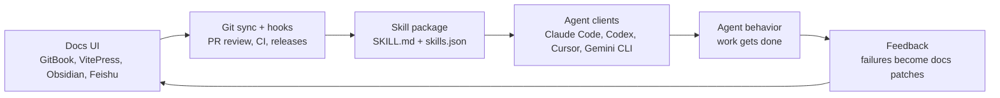

# Agent SkillDocs

Manage Agent Skills like docs. Distribute them through Git.

Agent SkillDocs is an open-source paradigm and starter kit for building human-readable, agent-executable workflow documentation. It treats `SKILL.md` files as team knowledge assets: people can browse, discuss, review, and improve them, while agents can install and execute them as procedural memory.

> Skills are not hidden prompts. They are operational docs for agents.

## The Idea

Most teams already have the raw material for great Agent Skills:

- onboarding docs
- research playbooks
- code review rules
- deployment checklists
- writing guidelines
- recurring AI instructions
- lessons from failed agent runs

The missing layer is a workflow that keeps humans and agents in the same loop.



This is the SkillDocs Loop:

1. Humans maintain skills in a readable documentation workflow.
2. Git records review, provenance, versions, and releases.
3. Hooks and CI validate the skill library.
4. Agents install or update the same `SKILL.md` files.
5. Agent failures become improvements to the docs.

## What This Is

Agent SkillDocs is:

- a docs-native management layer for team Agent Skills
- a Git-backed publishing workflow for `SKILL.md`
- a practical pattern for private skill libraries
- a future CLI and adapter toolkit for GitBook, VitePress, MkDocs, Obsidian, Feishu, and Yuque

It is not:

- a new `SKILL.md` standard
- a public skill marketplace
- a hosted prompt management platform
- an AI documentation generator
- a universal rich-text sync engine

## Why It Matters

Agent skills are becoming a portable way to package procedures for coding agents and research agents. But if skills only live in hidden config folders, chat snippets, or one person's machine, teams cannot govern them.

Agent SkillDocs makes skills visible and reviewable:

- technical writers can improve instructions
- researchers can encode repeatable methods
- engineers can review risky workflow changes
- agents can inherit the latest team practice
- teams can roll back bad instructions like code

The practical principle is simple:

> Keep the skill source human-readable. Keep the distribution path machine-reliable.

## Use The Pattern Today

The CLI is planned for the first implementation milestone. You can still use the pattern manually now:

```text
skills/
  literature-review/
    SKILL.md
    references/
  code-review/
    SKILL.md
  release-checklist/
    SKILL.md
skills.json
```

Recommended `SKILL.md` frontmatter:

```yaml
---
name: literature-review
description: Use this skill when the user needs a structured literature review workflow, paper triage, evidence extraction, or synthesis across academic sources.
category: Reading & Analysis
version: 0.1.0
owner: research-team
review_status: approved
---
```

Then connect the loop:

1. Use GitBook, VitePress, MkDocs, Obsidian, Feishu, or Yuque as the human editing surface.
2. Sync or export clean Markdown into `skills/<name>/SKILL.md`.
3. Review changes through Git pull requests.
4. Run hooks or CI to lint metadata, links, and generated registry files.
5. Let agents install or update from the Git repo.

## Planned CLI

The working CLI name is `skilldocs`.

```bash
skilldocs init
skilldocs lint
skilldocs generate registry
skilldocs generate gitbook
skilldocs generate vitepress
skilldocs doctor
```

Planned adapter commands:

```bash
skilldocs generate mkdocs
skilldocs generate obsidian
skilldocs normalize feishu
skilldocs normalize yuque
skilldocs export claude
skilldocs export codex
skilldocs export cursor
```

## What This Repository Should Contain

This repo is intended to become a complete public starting point:

```text
agent-skilldocs/
  README.md
  PLAN.md
  docs/                    # GitHub Pages site
  schemas/                 # skills.json schema
  packages/cli/            # skilldocs CLI
  adapters/
    gitbook/
    vitepress/
    mkdocs/
    obsidian/
    feishu/
    yuque/
  examples/
    gitbook-research-skills/
    vitepress-team-skills/
    obsidian-personal-skills/
    feishu-lab-skills/
  templates/
    team-skill-library/
    personal-skill-library/
  case-studies/
    vios-research-skills.md
```

## GitHub Pages

The project site lives in `docs/` and is designed to work with GitHub Pages.

Recommended setup:

1. Push this repository to GitHub.
2. In repository settings, enable Pages.
3. Choose GitHub Actions as the Pages source, or publish from the `docs/` folder.
4. The included workflow at `.github/workflows/pages.yml` publishes the static site.

## Launch Thesis

The first public release should not try to win by having the most adapters or the biggest marketplace. It should win by making one idea obvious:

> Agent Skills need the same care as docs and the same trust path as code.

That is the reason for Agent SkillDocs.
